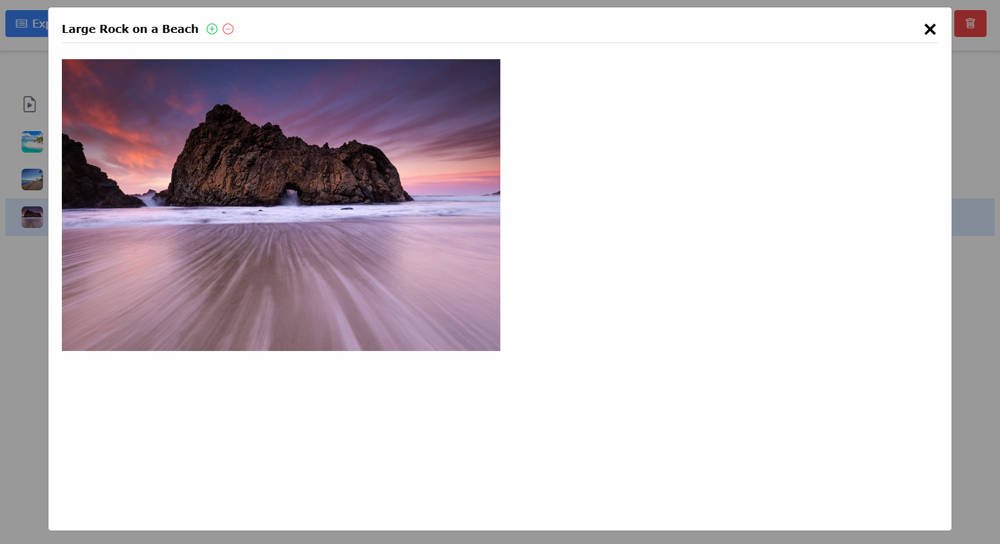

# File Hub
File Hub allows you to upload your own files and download existing ones that are stored directly on the server. Frontend written in 
React.JS and TailwindCSS. Backend in Node.JS

 

# Requirements
- NPM
- Node.JS
- Web Hosting Software (nginx, xampp) for client
- Enable Read & Write Permissions for Server folder: sudo chmod -R 777 /var/www/html/

# Server Usage
- Run node server.js located in /server/

# Client Usage
- Adjust ENV variables based on your preferences
- npm install